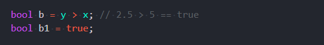

# Типы данных:

**int** - целое число

> *int x* = 5;

**double** - дробное число

> *double*  y = 2.5;

**string** - строка

> *string str* = "Привет всем!)";

**bool** - логический тип данных. Может принимать одно из значений

> *true* (истина)  

> *false* (ложь)

> 