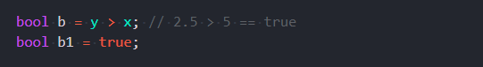
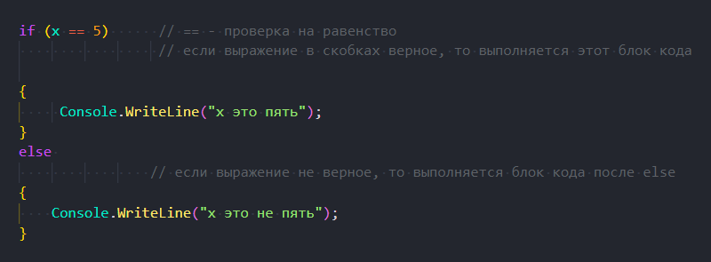
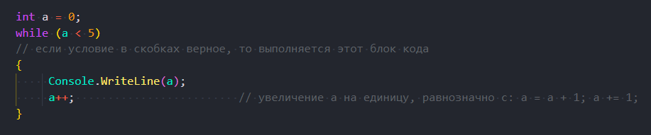
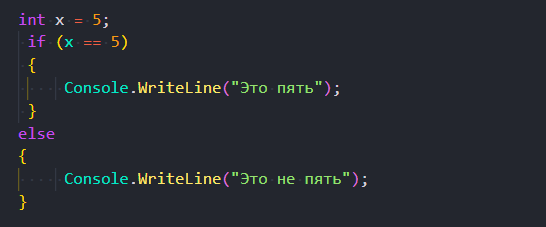
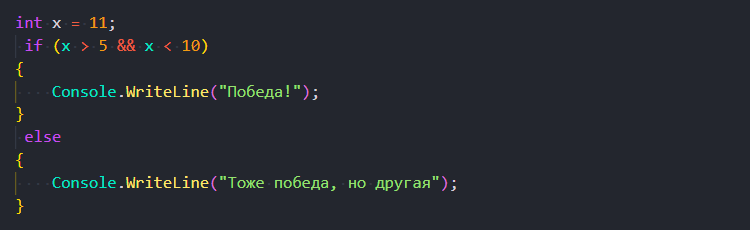
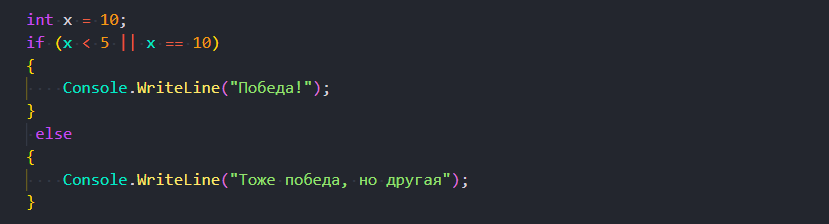
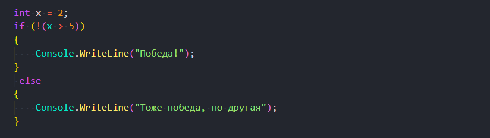
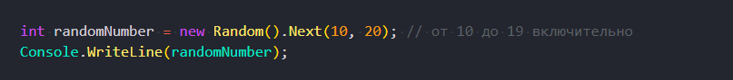
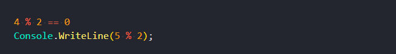
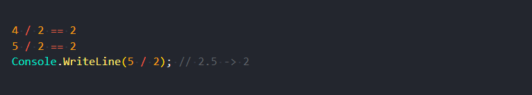

# Основы программирования на C#

## Типы данных:

**int** - целое число

> *int x* = 5;

**double** - дробное число

> *double*  y = 2.5;

**string** - строка

> *string str* = "Привет всем!)";

**bool** - логический тип данных. Может принимать одно из значений

> *true* (истина)  

> *false* (ложь)

**Блоки кода**

Пространство между двумя фигурными скобками называется блок кода

**{**

**}**

**Ветвление _if..else_**

**Цикл**

**Условные выражения**

> *==* - проверка на равенство

> *!=* - проверка на не равненство

> *>* - больше

> *<* - меньше

> *>=* - больше либо равно

> *<=* - меньше либо равно

**&& - логическое И (должны выполняться все условия)**

**|| - логическое ИЛИ (должны выполниться хотя бы одно условие)**

**! - логическое НЕ (если было true станет false и наоборот)**

> *int x* = 2;

> *if (!(x > 5))*

**Случайное число**

Диапазон указывается через запятую.
От первого числа включительно до второго числа НЕ включительно

**Операции с числами**

% - остаток от деления

 / - целая часть от деления (для целых чисел) или просто деление (для дробных чисел)

